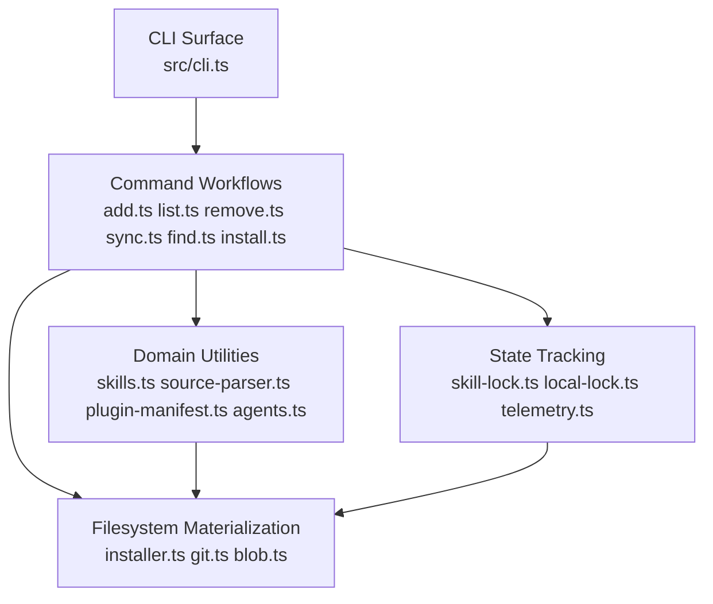
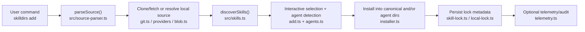

# Project Thesis

`skills` is a compatibility-oriented distribution layer for the agent-skills ecosystem, not just a package installer. Its real job is to normalize wildly different agent directory conventions, source formats, and update paths into one CLI surface that can install, sync, list, remove, and refresh reusable `SKILL.md` bundles across dozens of tools.

- The strongest evidence is that the architectural center is split across [src/cli.ts](f:\big-project\skill-dirs-cli\src\cli.ts), [src/add.ts](f:\big-project\skill-dirs-cli\src\add.ts), [src/installer.ts](f:\big-project\skill-dirs-cli\src\installer.ts), [src/skills.ts](f:\big-project\skill-dirs-cli\src\skills.ts), and [src/agents.ts](f:\big-project\skill-dirs-cli\src\agents.ts), rather than a single package-fetching module.
- The defining constraint is ecosystem heterogeneity: GitHub, GitLab, well-known endpoints, local paths, `node_modules`, plugin manifests, universal agent directories, and agent-specific directories all have first-class handling.
- This is not a generic package manager and not an agent runtime. It assumes the value lives in discovering, materializing, and tracking skill folders for other tools to consume.

**Project Metadata**

| Field | Value |
|-------|-------|
| Project Name | `skills` |
| Repository | `f:\big-project\skill-dirs-cli` |
| Primary Language | TypeScript on Node.js |
| License | MIT in `package.json`; commercially permissive, but the repo does not currently expose a top-level `LICENSE` file |
| Analysis Date | 2026-04-29 |

## Repository Shape

This is a single-package TypeScript CLI repository with one runtime package, one test suite, and a small amount of release automation.

| Area | Path | Role |
|------|------|------|
| Runtime CLI | `src/` | Command routing, skill discovery, installation, update, removal, sync, telemetry, and lock management |
| User-facing shim | `bin/cli.mjs` | Published entrypoint that invokes the built CLI |
| Test suite | `tests/` plus `src/*.test.ts` | Cross-platform path tests, parser tests, installer tests, lock tests, and command behavior tests |
| Release and metadata scripts | `scripts/` | Agent metadata validation/sync and third-party notice generation |
| Example skill | `skills/find-skills/SKILL.md` | A dogfooded skill bundled with the repo |
| CI metadata | `.github/workflows/` | Cross-platform CI, publish flow, and agent metadata workflow |

Repository shape matters here because the project is intentionally not a monorepo. That keeps publishing and CLI invocation simple, but it also means the main behavioral surface accumulates inside a small number of very large modules, especially [src/add.ts](f:\big-project\skill-dirs-cli\src\add.ts) and [src/cli.ts](f:\big-project\skill-dirs-cli\src\cli.ts).

## Tech Stack

This project uses a deliberately small Node.js stack where most of the complexity comes from filesystem and ecosystem integration rather than framework machinery.

| Category | Technology | Version | Architectural Role |
|----------|------------|---------|--------------------|
| Language | TypeScript | `5.9.3` | Gives the CLI a typed domain model for agents, skills, parsed sources, and lock files without introducing a framework runtime |
| Runtime | Node.js | `>=18` | Enables ESM, built-in `fetch`, filesystem APIs, child processes, and cross-platform path handling |
| CLI UX | `@clack/prompts`, `picocolors` | `0.11.0`, `1.1.1` | Keeps the interactive layer lightweight while allowing rich multi-step install flows |
| Parsing | `yaml` | `2.8.3` | Supports frontmatter parsing for `SKILL.md`, which is the core data model of the product |
| Build | `obuild` | `0.4.22` | Produces distributable output with minimal custom bundler code |
| Testing | `vitest` | `4.0.17` | Supports fast unit and integration-style filesystem tests across a broad matrix of path behaviors |
| Formatting | `prettier` | `3.8.1` | Enforces a consistent style in `src/` and `scripts/`; CI checks formatting on Ubuntu |
| SCM integration | `simple-git` | `3.27.0` | Used for clone and repo interactions without shelling out for every git operation |
| Platform config | `xdg-basedir` | `5.1.0` | Normalizes XDG-aware global install paths, which is important for Linux and shared agent directories |
| CI/CD | GitHub Actions | n/a | Runs cross-platform install/build/test/format validation and separate publish/metadata workflows |

**Dependency Observations**

- The dependency surface is intentionally narrow: 13 direct dependencies across runtime and development in [package.json](f:\big-project\skill-dirs-cli\package.json). That reduces supply-chain sprawl and keeps the CLI mostly explainable from local code.
- `@clack/prompts` and the custom prompt layer in [src/prompts/search-multiselect.ts](f:\big-project\skill-dirs-cli\src\prompts\search-multiselect.ts) are load-bearing because the tool relies on interactive selection and summary flows, not just positional commands.
- `yaml` is effectively part of the domain model because `SKILL.md` frontmatter is the thing being installed and indexed. Breaking that parser would break the product.

## Architecture Design

The project follows a modular CLI architecture with a thin command router and a handful of feature-heavy modules that each own one slice of the install lifecycle.

### Architecture Pattern

This is a single-binary CLI, but architecturally it behaves like a modular monolith. The code is organized by capability rather than by layered package boundaries: command routing in [src/cli.ts](f:\big-project\skill-dirs-cli\src\cli.ts), source parsing in [src/source-parser.ts](f:\big-project\skill-dirs-cli\src\source-parser.ts), discovery in [src/skills.ts](f:\big-project\skill-dirs-cli\src\skills.ts), filesystem installation in [src/installer.ts](f:\big-project\skill-dirs-cli\src\installer.ts), and state tracking in [src/skill-lock.ts](f:\big-project\skill-dirs-cli\src\skill-lock.ts) and [src/local-lock.ts](f:\big-project\skill-dirs-cli\src\local-lock.ts). That keeps runtime packaging simple, but it also means architectural discipline depends on file-level ownership rather than package boundaries.

### Execution Flow

The trustworthy local workflow is straightforward, but the behavior fans out at runtime based on source type and install scope.

```text
Build:  pnpm build
Run:    pnpm dev <command>   or   node src/cli.ts <command>
Test:   pnpm test
Deploy: push to main or tag -> .github/workflows/publish.yml -> npm publish
```

- `pnpm build` is not a pure compile step; it also runs [scripts/generate-licenses.ts](f:\big-project\skill-dirs-cli\scripts\generate-licenses.ts) via the `build` script in [package.json](f:\big-project\skill-dirs-cli\package.json).
- The CI workflow labels the build step as "Type check" but runs `pnpm build` in [.github/workflows/ci.yml](f:\big-project\skill-dirs-cli\.github\workflows\ci.yml), so compile success and artifact generation are coupled in automation.

### Layer Structure

The codebase is layered by operational responsibility, but the boundaries are soft and coordinated through direct module imports rather than formal interfaces.



- The CLI surface mostly routes commands and prints output, but update logic in [src/cli.ts](f:\big-project\skill-dirs-cli\src\cli.ts) is substantial enough that the router is not purely thin.
- Command modules depend directly on both domain and infrastructure helpers, which keeps the code practical but increases coupling.

### Data Flow

A typical install path is source normalization first, skill discovery second, and filesystem projection last.



That flow matters because the project is not storing an abstract package graph. It is projecting content onto concrete agent-specific directories, so path safety, symlink behavior, and lock metadata are part of the product logic, not incidental utilities.

## Core Modules

The real weight of this repository lives in the modules that convert arbitrary skill sources into stable local filesystem layouts.

### Command Router `[src/cli.ts](f:\big-project\skill-dirs-cli\src\cli.ts)`

- **Role**: Owns command dispatch, help/banner rendering, `init`, and most of the update/check workflow.
- **Key inputs/outputs**: Consumes argv and local/global lock files; produces console UX, update decisions, and re-invocations of the CLI for refresh.
- **Why it matters**: Update behavior is centralized here, including scope detection, legacy lock handling, GitHub hash comparison, and reinstall orchestration. Changing it would alter the user's mental model of the whole tool.

### Install Orchestrator `[src/add.ts](f:\big-project\skill-dirs-cli\src\add.ts)`

- **Role**: Orchestrates source parsing, clone/fetch, skill filtering, agent selection, install summaries, security audit display, installation, and post-install lock writes.
- **Key inputs/outputs**: Consumes parsed source identifiers, prompt choices, and discovered skills; produces installed skill directories and lock entries.
- **Why it matters**: This file is the feature nexus. It is where source diversity, UX complexity, and persistence rules all meet, which makes it both indispensable and a maintainability hotspot.

### Filesystem Installer `[src/installer.ts](f:\big-project\skill-dirs-cli\src\installer.ts)`

- **Role**: Converts discovered skill content into canonical and agent-specific directories via symlink or copy modes.
- **Key inputs/outputs**: Consumes `Skill` or remote/blob skill objects plus agent configs; produces copied directories, symlinks, and install path metadata.
- **Why it matters**: This module is where the product stops being metadata and starts being concrete user state. Its path-safety checks, symlink fallback behavior, and universal-agent semantics directly determine whether installs are safe and portable.

### Skill Discovery Engine `[src/skills.ts](f:\big-project\skill-dirs-cli\src\skills.ts)` and `[src/plugin-manifest.ts](f:\big-project\skill-dirs-cli\src\plugin-manifest.ts)`

- **Role**: Finds valid `SKILL.md` directories across conventional paths, recursive search, internal-skill rules, and Claude plugin manifests.
- **Key inputs/outputs**: Consumes a base path, optional subpath, and discovery options; produces normalized `Skill` objects and plugin grouping metadata.
- **Why it matters**: Discovery is the product's schema boundary. If these rules are wrong, installs become incomplete, duplicated, or insecure.

### Agent Compatibility Matrix `[src/agents.ts](f:\big-project\skill-dirs-cli\src\agents.ts)`

- **Role**: Encodes per-agent project/global directories and detection heuristics for a very large set of supported tools.
- **Key inputs/outputs**: Consumes environment state and home-directory conventions; produces agent configs and installed-agent detection results.
- **Why it matters**: The repo's main differentiator is not just skill installation but cross-agent compatibility. This file is effectively the product catalog of supported ecosystems.

### Locking and Update State `[src/skill-lock.ts](f:\big-project\skill-dirs-cli\src\skill-lock.ts)` and `[src/local-lock.ts](f:\big-project\skill-dirs-cli\src\local-lock.ts)`

- **Role**: Persist global and project install state, including GitHub tree hashes, local content hashes, selected agents, and prompt dismissal state.
- **Key inputs/outputs**: Consumes install/update metadata and filesystem content; produces deterministic JSON lock files for refresh logic.
- **Why it matters**: The tool's promise of repeatability and updates depends on these files. The split between global lock state and project lock state is a deliberate tradeoff between richer metadata and merge-friendliness.

### Node Modules Sync Path `[src/sync.ts](f:\big-project\skill-dirs-cli\src\sync.ts)`

- **Role**: Crawls `node_modules`, discovers embedded skills, installs them project-locally, and records content hashes.
- **Key inputs/outputs**: Consumes package directory trees and local locks; produces synced skill directories under project scope.
- **Why it matters**: This is a strong signal that the project wants skills to behave like distributable assets inside package ecosystems, not only as Git repositories.

## Distinctive Design Decisions

Several non-obvious choices define how this CLI behaves under extension and change.

1. **Canonical `.agents/skills` storage with agent projections**: The installer writes to a canonical directory and then symlinks or copies into agent-specific locations in [src/installer.ts](f:\big-project\skill-dirs-cli\src\installer.ts). That reduces duplication and makes updates cheaper, but it forces the project to own tricky cross-platform symlink behavior.

2. **Universal-agent abstraction**: Agents that already share `.agents/skills` are treated specially in [src/agents.ts](f:\big-project\skill-dirs-cli\src\agents.ts) and [src/installer.ts](f:\big-project\skill-dirs-cli\src\installer.ts). This avoids redundant symlinks and duplicate listings, but it makes install semantics depend on encoded agent taxonomy rather than raw paths.

3. **Two lock systems for two scopes**: Global installs use GitHub tree hashes and user-state metadata in [src/skill-lock.ts](f:\big-project\skill-dirs-cli\src\skill-lock.ts), while project installs use deterministic content hashes and conflict-minimizing JSON in [src/local-lock.ts](f:\big-project\skill-dirs-cli\src\local-lock.ts). That is a sharp, thoughtful split: global state optimizes for update automation, project state optimizes for version control ergonomics.

4. **Discovery prefers conventions before recursion**: [src/skills.ts](f:\big-project\skill-dirs-cli\src\skills.ts) checks a wide set of well-known paths before falling back to recursive search. This keeps common installs fast and predictable while still supporting unconventional repos, but it also means the compatibility surface must be maintained actively.

5. **Plugin manifest compatibility is treated as first-class discovery**: [src/plugin-manifest.ts](f:\big-project\skill-dirs-cli\src\plugin-manifest.ts) reads Claude plugin manifests and maps skill groupings. That makes the CLI more useful as an ecosystem bridge, not merely a repo scraper.

6. **Update reinstallation re-enters the published CLI**: The update path in [src/cli.ts](f:\big-project\skill-dirs-cli\src\cli.ts) shells back into `bin/cli.mjs add ...` instead of sharing a lower-level update primitive. This reduces duplicate code and keeps update behavior aligned with install behavior, but failures are harder to reason about because the flow hops through another process boundary.

## Quality Signals & Risks

The quality posture is better than many small CLIs because the repo has substantial path-focused tests and cross-platform CI, but the core install workflow still concentrates a lot of complexity in a few large files.

### Testing

| Metric | Status | Observation |
|--------|--------|-------------|
| Test Framework | `vitest` | Defined in [package.json](f:\big-project\skill-dirs-cli\package.json) and used across `src/*.test.ts` and `tests/*.test.ts` |
| Unit Tests | Present | 21 dedicated test files cover parser logic, path safety, lock behavior, discovery depth, symlink/copy installation, and distribution output |
| Integration Tests | Present | Many tests are filesystem-heavy and closer to integration tests than pure units, especially installer and discovery suites |
| E2E Tests | Limited | There is no obvious full published-CLI smoke test against real installed agents from static inspection |
| Test Quality | Good | Coverage appears targeted at the repo's real risk areas: cross-platform paths, install modes, lock files, and discovery rules |

### CI/CD

GitHub Actions validates the repository on Ubuntu and Windows in [.github/workflows/ci.yml](f:\big-project\skill-dirs-cli\.github\workflows\ci.yml), which fits the path-sensitive nature of the project. The publish workflow in [.github/workflows/publish.yml](f:\big-project\skill-dirs-cli\.github\workflows\publish.yml) handles version bump policy, npm publish, and GitHub release creation. A separate workflow in [.github/workflows/agents.yml](f:\big-project\skill-dirs-cli\.github\workflows\agents.yml) validates `src/agents.ts` changes and syncs generated metadata back into `README.md` and `package.json`, which is a pragmatic way to keep the support matrix from drifting.

### Documentation

| Document | Status | Quality |
|----------|--------|---------|
| README | Present | Good for command usage and supported agents |
| API Docs | Absent | This is a CLI, so module-level docs would matter more than API docs |
| Architecture Docs | Present | `AGENTS.md` is useful and unusually concrete for contributors |
| Inline Comments | Adequate | The code comments focus on path handling and behavioral edge cases rather than narration |
| Onboarding Guide | Partial | `README.md` plus `AGENTS.md` is enough for contributors, but there is no separate contributor playbook |

### Code Style & Hygiene

- Formatting is enforced with Prettier in [package.json](f:\big-project\skill-dirs-cli\package.json), and CI checks it on Ubuntu.
- Type checking exists as `pnpm type-check`, but CI currently relies on `pnpm build`, not `pnpm type-check`, which is slightly less explicit.
- The codebase is mostly free of obvious `TODO` or `FIXME` debt markers. The notable repeated marker is `legacy`, which reflects active backward-compatibility work rather than abandoned code.

### Risk Table

| # | Risk | Severity | Category | Evidence | Impact |
|---|------|----------|----------|----------|--------|
| 1 | The main install workflow is concentrated in a very large orchestrator file | Medium | Maintainability | [src/add.ts](f:\big-project\skill-dirs-cli\src\add.ts) | Future changes to install behavior are more likely to create regressions because UX, source handling, filesystem writes, telemetry, and lock updates all meet in one place |
| 2 | CI labels a build as a type-check and does not separately enforce `pnpm type-check` | Low | Reliability | [.github/workflows/ci.yml](f:\big-project\skill-dirs-cli\.github\workflows\ci.yml), [package.json](f:\big-project\skill-dirs-cli\package.json) | Type-only regressions are still likely to be caught by build, but the validation contract is less explicit than the scripts suggest |
| 3 | Commercial reuse evidence is slightly weakened because the repo lacks a top-level `LICENSE` file | Medium | Commercial Viability | [package.json](f:\big-project\skill-dirs-cli\package.json) and no `LICENSE*` file at repo root | Package consumers can infer MIT from npm metadata, but due diligence for direct source reuse is less clean |
| 4 | Outbound telemetry and audit calls are embedded in normal workflows | Low | Operations | [src/telemetry.ts](f:\big-project\skill-dirs-cli\src\telemetry.ts), [src/add.ts](f:\big-project\skill-dirs-cli\src\add.ts) | The calls are optional and guarded, but privacy-sensitive adopters may want stronger documentation or an explicit first-run notice |
| 5 | Update automation is strongest for GitHub-backed installs and weaker for local, git, well-known, and legacy entries | Medium | Reliability | [src/cli.ts](f:\big-project\skill-dirs-cli\src\cli.ts), [src/skill-lock.ts](f:\big-project\skill-dirs-cli\src\skill-lock.ts) | Users may experience inconsistent update behavior depending on source type, which is understandable architecturally but worth setting expectations around |

### Commercial & Reuse Viability

The intended licensing posture is permissive: MIT allows commercial use and closed-source embedding, but a missing top-level license file is still worth fixing for clarity.

- **Commercial use**: Yes, based on `license: "MIT"` in [package.json](f:\big-project\skill-dirs-cli\package.json).
- **Closed-source embedding**: Yes. MIT does not require proprietary derivatives to publish source.
- **Modification & redistribution**: Allowed, provided the MIT copyright and license notice are preserved.
- **Secondary development**: Reasonably safe. The main obligations are attribution and keeping the license text with redistributed copies.
- **Patent clauses**: MIT does not include an explicit patent retaliation mechanism; its patent posture is simpler and less protective than Apache-2.0.
- **Attribution requirements**: Include the MIT license notice and copyright notice in substantial redistributed copies.

## Unknowns Worth Verifying

The biggest remaining unknowns are runtime and ecosystem behaviors that static inspection cannot fully prove.

- **Real-world agent compatibility drift**: [src/agents.ts](f:\big-project\skill-dirs-cli\src\agents.ts) encodes many agent paths and detection heuristics, but static analysis cannot confirm that each external product still honors those paths in current releases.
- **Published artifact fidelity**: The source layout is clear, but I did not run `pnpm build` or inspect `dist/`, so the exact emitted package shape and source-map fidelity remain unverified.
- **Symlink behavior on constrained Windows environments**: The installer contains thoughtful fallback logic in [src/installer.ts](f:\big-project\skill-dirs-cli\src\installer.ts), but static reading cannot confirm user experience under locked-down corporate Windows policies.
- **Telemetry endpoint durability and data policy**: The code shows opt-out environment variables and timeout handling in [src/telemetry.ts](f:\big-project\skill-dirs-cli\src\telemetry.ts), but static analysis cannot verify retention policy, uptime, or operational expectations of the remote service.
